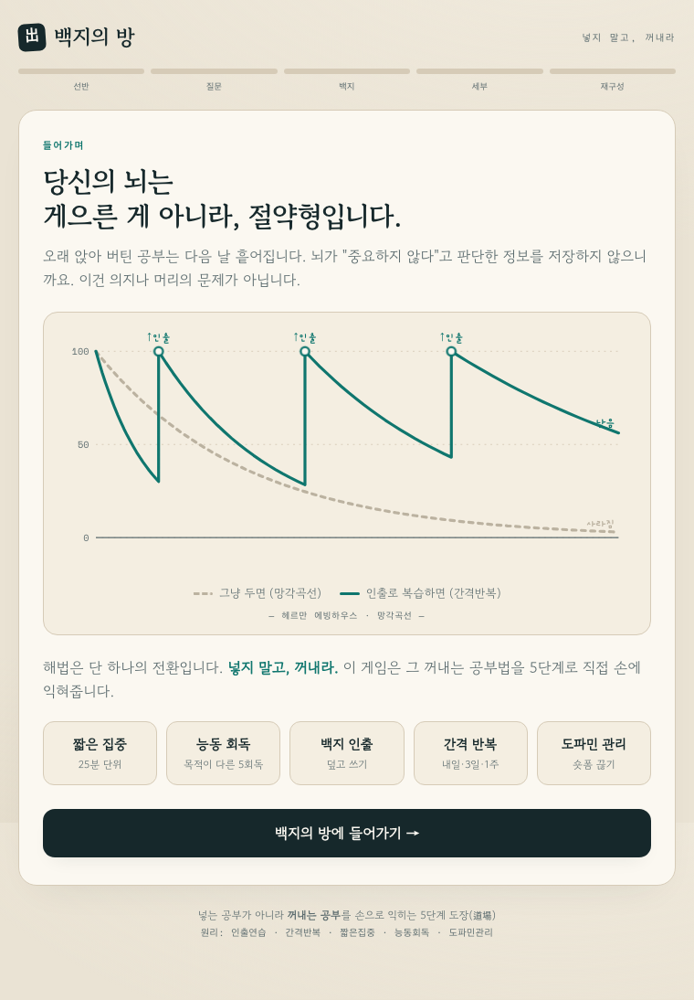

# 백지의 방 (brain-game)

> **넣지 말고, 꺼내라.** — 뇌과학 공부법을 글로 읽는 대신, 5단계로 직접 손에 익히는 인터랙티브 학습 게임.

**▶ 데모: https://aeterkhan.github.io/brain-game/**



---

## 기획 의도

대부분의 사람은 "오래 앉아 버티는 것"을 공부라고 믿습니다. 하지만 뇌는 게으른 게 아니라 **절약형**이라, 중요하지 않다고 판단한 정보는 빠르게 버립니다(에빙하우스 망각곡선). 그래서 3시간을 앉아 있어도 다음 날 기억나지 않는 건 의지나 머리의 문제가 아니라, **저장 방식의 문제**입니다.

핵심 전환은 하나입니다.

- 책을 **읽는 것** = 정보를 뇌에 **넣는** 행동
- 백지에 **쓰는 것** = 정보를 **꺼내는** 행동 → 뇌는 꺼낼 때 훨씬 강하게 자극받아 기억이 단단해진다

이 원리(인출 연습, retrieval practice)는 알지만, **실제로 손에 익히기는 어렵습니다.** 글로 읽으면 "유창성 착각"(여러 번 읽어 익숙해져 안다고 느끼지만 덮으면 설명 못 하는 상태)에 빠지기 쉽기 때문입니다.

그래서 이 프로젝트는 그 공부법을 **읽는 콘텐츠가 아니라 직접 해보는 게임**으로 만들었습니다. 사용자는 5단계 "도장(道場)"을 통과하며, 각 단계에서 뇌과학 원리를 게임 메커니즘으로 몸소 경험합니다.

> 영감이 된 원문: Threads [@ftj.kr](https://www.threads.com/@ftj.kr) "뇌과학 공부법" 스레드 (인출 연습 · 목적이 다른 5회독 · 25분 집중 · 도파민 관리)

---

## 무엇을 하나 — 5단계 도장

각 단계는 단순한 설명이 아니라, 그 원리를 **체험하게 만드는 인터랙션**입니다.

| 단계 | 이름 | 게임 메커니즘 | 체득하는 뇌과학 원리 |
|---|---|---|---|
| 1 | **선반 만들기** | 플래시카드 5장 뒤집기 | 암기 전에 전체 구조(스키마)부터 — 정보를 얹을 "선반" |
| 2 | **질문 던지기** | 객관식 퀴즈 (문항·보기 매번 셔플) | "왜?"를 던지는 능동 읽기 · 전전두엽 자극 |
| 3 | **백지 인출** | 빈 종이에 직접 쓰기 → 자동 채점 | 핵심. 덮고 꺼내는 인출 연습 |
| 4 | **세부 파기** | 객관식 퀴즈 | 인출에서 빠진 디테일(각주·구석) 보완 |
| 5 | **전체 재구성** | 드래그로 순서 재배열 | 목차만 보고 남에게 설명하듯 흐름 복원 |

**마무리(결과 화면):** 기억 강도 점수 + **간격 반복**(내일·3일·1주) 예약 + **25분 집중 타이머** + 도파민 관리 경고.

설계를 관통하는 디테일:
- 퀴즈는 문항/보기 순서가 매번 바뀌어 "답 위치 외우기"를 막고 원리를 떠올리게 함
- 백지 인출은 정답을 펼치기 전엔 화면에 정답이 보이지 않아 **베끼기 불가** — 꺼내려 애쓰는 부하 그 자체가 학습
- 종이 질감의 차분한 디자인으로 숏폼식 자극과 정반대의 "느리고 깊은" 환경 조성

---

## 적용한 학습 원리

- **인출 연습 (Retrieval Practice)** — 넣기보다 꺼내기
- **간격 반복 (Spaced Repetition)** — 잊을 만할 때 다시 꺼내기 (내일 · 3일 · 1주)
- **짧은 집중 (Pomodoro)** — 총량보다 집중의 질, 25분 단위
- **능동 회독 (목적이 다른 5회독)** — 같은 책을 매번 다른 목적으로
- **도파민 관리** — 공부 전후 숏폼 차단

---

## 기술

- **단일 HTML 파일**, 외부 라이브러리 0개 (바닐라 JS)
- gzip 전송 약 17KB로 매우 가벼움 — 즉시 로드
- 외부 의존성은 Google Fonts(Gowun Batang/Dodum, Gaegu, Space Mono)뿐
- 드래그 재배열은 측정 진동 없는 transform 기반 (드롭 시 1회 재계산)
- 반응형(모바일/데스크탑), `prefers-reduced-motion` 대응

## 로컬에서 실행

설치·빌드 없이 파일만 열면 됩니다.

```bash
git clone https://github.com/aeterkhan/brain-game.git
cd brain-game
open index.html        # macOS (또는 브라우저로 index.html 열기)
```

## 로드맵

MVP 이후 확장 방향(콘텐츠 분리 → 멀티 게임 → 상태 영속/간격 반복 → 백엔드)은 [PROJECT_PLAN.md](PROJECT_PLAN.md) 참고.

---

## 면책

학습 원리는 대중 과학 콘텐츠(위 Threads 스레드)에서 출발했습니다. 인용된 일부 연구·수치는 SNS 출처이므로, 엄밀한 학술 인용이 필요하면 원 논문 확인을 권장합니다. 이 프로젝트의 목적은 학술 고증이 아니라 **좋은 공부 습관을 손에 익히는 경험**입니다.
